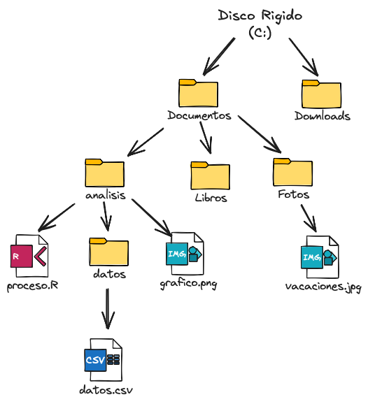

## Objetivos de aprendizaje

- Entender el sistema de archivos y directorios.
- Comprender la diferencia entre rutas absolutas, relativas, locales y remotas.
- Crear una jerarquía de directorios que coincida con un diagrama dado.
- Crear, mover y eliminar archivos y/o directorios específicos.
- Interactuar con la interfaz de RStudio para navegar archivos y directorios
- Interpretar las rutas como ubicaciones dentro de las carpetas
- Crear proyectos RStudio e identificar el directorio de trabajo
- Reconocer los paneles de la interfaz de RStudio y sus ubicaciones por defecto

## Conociendo el sistema de archivos

Ya sea para analizar datos, entrenar un modelo, generar un informe o guardar los resultados de un experimento, las computadoras son responsables de almacenar todos los datos involucrados en esas tareas. Que estos datos se guarden de forma segura y eficiente es fundamental para el funcionamiento de cualquier sistema y **el sistema de archivos** es el componente del sistema operativo que se encarga de esta tarea.

Segun el sistema operativo hay diferentes sistemas de archivos, pero todos son la estructura de datos que se utiliza para almacenar y recuperar información. Los unidad mínima de información en este sistema son los **archivos** y cada uno tiene un formato que depende del tipo de contenido que almacena. Este formato suele indicarse mediante la *extensión del archivo*, que aparece al final de su nombre.

Algunas extensiones comunes y sus tipos de archivo, habituales en ciencia de datos con R, son:

- `.R` para scripts de R
- `.Rmd` o `.qmd` para documentos reproducibles (R Markdown o Quarto)
- `.csv` para datos tabulares en texto plano
 
Estos archivos, a su vez, se organizan en **directorios (directory)** o **carpetas (folder)**. Un directorio es una estructura de datos que contiene referencias a archivos y a otros directorios. Generalmente, los directorios se organizan en una estructura jerárquica en forma de árbol, conocida como *árbol de directorios*. Este tipo de organización es muy común en proyectos de análisis de datos, por ejemplo separando código, datos crudos, datos procesados y resultados.

::: importante

El sistema de archivos cumple un rol similar tanto cuando trabajamos con archivos almacenados en nuestra propia computadora (por ejemplo, en el disco rígido) como cuando usamos servicios en la nube, como Google Drive o Dropbox.

Sin embargo, no son lo mismo: en **la nube** los archivos no están físicamente en nuestra máquina, sino que se almacenan en **servidores remotos** y se accede a ellos a través de internet. Muchos servicios en la nube imitan la estructura de un sistema de archivos local para que la experiencia de uso sea familiar, pero detrás de escena _el acceso, la sincronización y los permisos funcionan de manera diferente_.

Tenemos que ser conscientes de estas diferencias para evitar problemas de acceso a los archivos cuando trabajemos. **Nuestro consejo es trabajar en carpetas locales de los archivos que necesitamos para nuestro análisis (no colocar los proyectos en DropBox o similar).** De ese modo, nos aseguramos de que nuestro código pueda acceder a los archivos sin problemas de conexión o permisos.

:::





En la figura se ve un arbol de directorios: en la raíz del árbol se encuentra la unidad `C:` (que suele corresponder al disco rigido de la maquina) y a partir de ahí se ramifican los distintos directorios y archivos. `Documentos` y `Downloads` son dos carpetas que dependen del directorio *raiz*. Las carpetas `analisis`, `Fotos` y `Libros` dependen de `Documentos`. Dentro de la carpeta `analisis` se encuentran tres archivos: `proceso.R` y `grafico.png` y un subdirectorio (o subcarpeta) llamada `datos`, que contiene el archivo `datos.csv`. Ademas, dentro de la carpeta `Fotos` se encuentra el archivo `vacaciones.jpg`.

### Rutas (y caminos) absolutas y relativas

Las carpetas ordenan los archivos, para poder acceder a su contenido necesitamos "entrar" en ellas. Para eso, utilizamos las **rutas (path)**, que son secuencias de nombres de directorios y archivos que indican la ubicación de un archivo o directorio dentro del sistema de archivos. Es como una dirección postal que indica exactamente dónde encontrar un archivo o carpeta. Tenemos dos tipos de rutas:

* **Ruta absoluta:** especifica la ubicación completa desde la raíz del sistema. En Windows comienza con una letra de unidad (C:, D:), mientras que en Mac/Linux comienza con /.

Por ejemplo, la ruta `C:/Documentos/analisis/proceso.R` indica que el archivo `proceso.R` se encuentra dentro de la carpeta `analisis`, que a su vez está dentro de la carpeta `Documentos`, que está en la raíz del disco `C:`.

* **Ruta relativa:** especifica la ubicación en **relación con el directorio de trabajo actual**. Por ejemplo, si tu directorio de trabajo actual es `C:/Documentos/analisis`:

- la ruta relativa `proceso.R` se refiere al mismo archivo que la ruta absoluta `C:/Documentos/analisis/proceso.R`.

- la ruta relativa `../Fotos/vacaciones.jpg` se refiere al archivo `vacaciones.jpg` que se encuentra en la carpeta `Fotos`, que es un nivel más arriba en la jerarquía de directorios (y por eso se usa `../`).

- la ruta relativa `datos/datos.csv` se refiere al archivo `datos.csv` que se encuentra dentro de la carpeta `datos`, que a su vez está dentro del directorio de trabajo actual.

El **directorio de trabajo** (working directory) es la carpeta desde la cual R está trabajando en este momento. Es el punto de referencia para todas las rutas relativas.

::: importante

Es fundamental saber donde estamos trabajando y donde se encuentran los archivos que necesitamos para trabajar porque de esta manera evitamos errores debido a rutas incorrectas. 

Por ejemplo, si intentamos leer un archivo con una ruta relativa que no existe en el directorio de trabajo actual, obtendremos un error indicando que el archivo no se encuentra a pesar que el archivo existe.  Esto es debido a que no existe en el lugar que le indicamos.

:::

## Nombrar archivos y carpetas de forma inteligente

Para evitar errores de "file not found" (archivo no encontrado) y otros problemas relacionados con el sistema de archivos, es importante seguir algunas buenas prácticas al nombrar archivos y carpetas.

::: tip

* **Barras en rutas**: En R, usa siempre `/` (forward slash) o `\\` (doble backslash) en rutas de Windows. La barra simple \ no funciona.

* **Mayúsculas y minúsculas**: En Windows no importa, pero en Mac/Linux sí. Usa siempre el caso correcto.

* **Espacios en nombres**: Evita espacios en nombres de archivos y carpetas. Usa guiones bajos (_) o guiones (-).

* **Acentos y caracteres especiales**: Pueden causar problemas en diferentes sistemas operativos. Mejor evítalos.

:::

En la siguiente leccion veremos como podemos ordenar nuestro trabajo para evitar este tipo de errores y facilitar la reproducibilidad de nuestro trabajo.


## El problema

Imagina que arrancas el cuatrimestre y tenes que continuar con un proyecto de análisis de datos. 
O mejor te tomaste unas largas vacaciones.
Por supuesto, todo el código y los datos están en una única carpeta y además lo publicaste en un repositorio público.
Es hora de volver a trabajar, pero ¿qué fue lo último que hiciste? ¿qué falta?. 

Empezas a revisar la carpeta del proyecto y encuentras algo así.

```
/home/dorothy/Documentos/proyecto
├── resumen.R
├── correlation.png
├── datos.csv
├── datos2.csv
├── fig1.png
├── figura2(copy).png
├── figura.png
├── figura1.png
├── figura10.png
├── datos_crudos.csv
├── script.R
└── script_final.R
```

Y no tienes ni idea por donde arrancar.
Hay tres archivos `.R` que podrían ser el script con el código que escribiste, varios posibles archivos que contienen algunos "datos" no especificados y un montón de archivos de imagenes con nombres que dan poca información sobre su contenido.
Sin un archivo README (documento descriptivo) ni ninguna otra documentación que te ayude a resolver este lío, es muy posible que cueste mucho tiempo volver al punto en el que estabas y continuar con tu trabajo.

Para evitar esta situación necesitamos tener en cuenta la reproducibilidad y el desarrollo de software desde el inicio.
La reproducibilidad tiene que ver tanto con las personas que interactúan con el código como con las máquinas que deben ejecutarlo.
Hacer que tu código y análisis sea reproducible es permitir que otras personas (y vos en el futuro) puedan revisar, usar y ampliar tu trabajo.
Esto requerira aplicar distintos principios de programación y desarrollo de software que veremos a lo largo del curso.
Empecemos organizando el trabajo. 

## Crear un proyecto organizado

Lo que cuenta como "organizado" es muy personal, pero lo principal es que la estructura de carpetas y los nombres de los archivos deben:

1. ser autodocumentados
2. ser útiles a la hora de escribir código
3. estar en el mismo lugar, es decir, todos los archivos necesarios están dentro de la carpeta raíz 

### Archivos que se autodocumentan

Aprovechá carpetas con nombres informativos para autodocumentar las distintas partes de tu análisis.

Coloca tus datos en `datos`, los scripts de preprocesamiento en `scripts` o `preprocesamiento` y tu análisis en `analisis`.
Utiliza también subcarpetas, como `datos/crudos` para guardar los datos originales y `datos/derivados` para los datos preprocesados y depurados.

Nombrá tus archivos de modo que puedas saber que incluyen aún si pasaron 10 años desde que los creaste.

Utiliza nombres cortos, descripciones breves de lo que hay dentro.

::: ejercicio

Describi cuál crees que es el contenido de estos archivos:

- `datos/crudos/madrid_temperatura-minima.csv`

- `scripts/02_calcula_temperatura-media.R`

- `analysis/01_madrid_temperatura-minima_analisis-estadistico.Rmd`

:::

::: ejercicio

Pensá en buenos nombres de archivos y carpetas para:

- un conjunto de datos sobre gatos con columnas para el peso, la longitud, la longitud de la cola, el color o colores del pelaje, el tipo de pelaje y el nombre.

- un script que descarga datos de Spotify.

- un script que limpia los datos de Spotify.

- un script que ajusta un modelo lineal y lo guarda en un archivo.

- el archivo .Rds en el que se guarda ese modelo.

:::

::: tip

Utiliza una estructura de carpetas conocida

No existe una única estructura de carpetas objetivamente mejor.
En caso de duda, intenta seguir las convenciones de tu comunidad de investigación.
Esto minimizará cualquier fricción entre tú y tu público potencial.
:::

### Archivos con los que puedes programar

Recuerda siempre que las computadoras son bastante tontas, así que sé amable y utiliza nombres de archivo que puedan entender fácilmente.

En algunos casos, los nombres de archivo con espacios confunden a las computadoras, por lo que en general es mucho más fácil trabajar si los nombres de archivo utilizan guiones para dividir las palabras.
Del mismo modo, algunas máquinas no pueden manejar "caracteres especiales" como la "ñ" o las tildes.
También es mejor evitar algunos símbolos (".", "\*", y otros) porque tienen un significado especial en las expresiones regulares.

Algunos sistemas de archivos no distinguen entre mayúsculas y minúsculas, por lo que `Temperatura-Madrid.csv` y `temperatura-madrid.csv` pueden ser el mismo archivo.

Para evitar dolores de cabeza, es mejor y por el lado conservador y solo utilizar caracteres latinos en minúsculas, números y guiones ("\_" y "-").

Utiliza guiones como separadores.
Puedes utilizar "-" para separar palabras que formen parte del mismo concepto y "\_" para separar conceptos.
Por ejemplo `temperatura-minima_buenos-aires.csv`, en este caso `temperatura-minima` es un cocepto y `buenos-aires` otro. 
Recomendamos esta convención y no al revés, porque es compatible con el formato de fecha ISO ("AAAA-MM-DD").

::: tip

Si utilizás los separadores de forma coherente e inteligente, podrás analizar los nombres de los archivos como parte de tu código.
Por ejemplo, si tienes

```{r, include=FALSE}
ciudades <- c("madrid", "buenos-aires")
variables <- c("temperatura-minima", "temperatura-maxima")
archivos <- with(expand.grid(ciudades, variables), paste0(Var1, "_", Var2))
```

```{r}
archivos
```

También podrías extraer ciudades y nombres de variables desde los nombres de los archivos

```{r}
strsplit(archivos, "_")
```

:::

Por último, intentá que tus archivos sean fácilmente ordenables.
Comezá el nombre del archivo con números (que incluya suficientes ceros a la izquierda) y, si aplica, utilizá fechas en formato AAAA-MM-DD para que el orden de los archivos por nombre coincida con el orden por fecha.

### Que tu proyecto sea autocontenido

Un aspecto importante a la hora de pensar en tu proyecto es que todos los scripts, datos, figuras y cualquier otra cosa que se necesite para (re)crear el análisis esté dentro de la misma carpeta raíz.
De ese modo te aseguras de que lo único que tienes que dar a otra persona para que ejecute correctamente tu código es esa única carpeta.
También te facilita la vida si trabajas en el mismo proyecto en distintas computadoras, ya que te permite sincronizar una única carpeta.

::: importante
Más adelante veremos como *empaquetar* código para compartirlo con otras personas.
:::

Un paso extra a tener en cuenta es que no puedes hacer que tu trabajo sea portable si tu código no lo es también.
Quizás el principal culpable de que el código no sea portable sea utilizar rutas absolutas para manipular archivos en tu código.

La siguiente línea de código lee el archivo `datos.csv`:

```{r, eval=FALSE}
read.csv("/home/dorothy/Documentos/proyectos/mitrabajo/datos/datos.csv")
```

Aunque hayas descargado correctamente la carpeta `mitrabajo` desde algún repositorio, este código va a dar error porque es poco probable que hayas guardado esa carpeta dentro de `Documentos/proyectos` y que tu nombre de usuario en la computadora sea "dorothy".

En cambio, podes utilizar una ruta relativa:

```{r, eval=FALSE}
read.csv("datos/datos.csv")
```

Esto se ejecutará independientemente de dónde se encuentre la carpeta raíz de tu proyecto ya que hace referencia solo a lo que está adentro.
Como veremos a continuación los proyectos de RStudio ayudan a definir cual es la carpeta raíz de manera automática.

## Proyectos de RStudio

RStudio proporciona una forma ordenada y estructurada de separar tus proyectos en diferentes contextos.
No ayudan estrictamente a la reproducibilidad del producto final, pero te ayudarán a agilizar tu flujo de trabajo encapsulando cosas como la lista de archivos abiertos, el historial de comandos de R y la configuración de RStudio para cada proyecto.

Abrir un proyecto de RStudio también garantiza que inicies una nueva sesión de R cada vez y establece tu directorio de trabajo en la carpeta raíz del proyecto.

::: ejercicio

Creá un nuevo proyecto de RStudio

1. Hace clic en "File" y luego en "New Project...".
2. Hace clic en "New directory".
3. Verás una lista de varias plantillas. Selecciona "New project".
4. Escribí el nombre de la carpeta raíz en la que vivirá tu proyecto y selecciona la ubicaciónn en la que quieres que se cree esta carpeta haciendo clic en "Browse".
5. Hace clic en "Create project".

- ¿Cuál es la ruta absoluta a la carpeta de tu proyecto?
- Si cerrás RStudio, ¿cómo podés asegurarte de que tu carpeta de trabajo es la carpeta de tu proyecto la próxima vez que abras RStudio?

:::

Si todo salió bien, deberías tener una nueva carpeta con el nombre que elejiste para tu proyecto.
Es una carpeta común y corriente; lo que la distingue como proyecto de RStudio es el archivo .Rproj, que contiene las opciones de RStudio específicas del proyecto, y la carpeta oculta .Rproj.user, donde se encuentran los archivos temporales específicos del proyecto.

Cada proyecto de RStudio tiene su propio conjunto de opciones que podés cambiar sin alterar las opciones globales ni las de otros proyectos.

## Abrir un proyecto

La forma más sencilla de abrir un proyecto es abrir la carpeta que lo contiene y hacer doble clic en el archivo .Rproj.
También puedes abrir rápidamente un proyecto utilizado recientemente haciendo clic en el icono de proyecto situado a la derecha de la barra de herramientas de RStudio.

Esto abrirá una nueva ventana de RStudio con su propia sesión de R y la carpeta del proyecto será el directorio o carpeta raiz.
Por defecto, también abrirá los archivos abiertos anteriormente.
Incluso conservará los cambios no guardados.
Esto ayuda a mantener tu trabajo ordenado y facilita retomar o compartir lo que has hecho más tarde.

RStudio te permite tener abiertos varios proyectos, y esto es posible porque cada proyecto tiene su propia carpeta.
Puedes trabajar con varios proyectos en paralelo sin que el código o los resultados de un análisis interfieran con los de otro.

::: ejercicio

Abrí tu proyecto

1. En tu nuevo proyecto, crea un nuevo archivo .R y escribe algo de código (por ejemplo `print("Hola!")` o `x <- 2 + 2)`, no te olvides de guardarlo.
2. Cerrá la ventana de RStudio.
3. Ahora abrí una nueva ventana de RStudio y el proyecto de RStudio que acabas de cerrar (dependiendo de tus opciones globales, puede que se abra por defecto).

:::

## Borrón y cuenta nueva... todos los días

¿Cómo garantizamos que el análisis sea realmente reproducible?
Es una pregunta bastante amplia y existen muchas herramientas para resolver este problema.
Por ahora vamos a concentrarnos en que, al menos en tu computadora, puedas repetir los cálculos o el análisis desde cero.
Y además de organizar los proyectos y no modificar los datos originales, ¿cómo podés asegurarte de guardar todo el código que estuviste usando y genera el análisis?
La forma más directa es reiniciar la sesión de R y volver a ejecutar el código, si da un error o no devuelve lo que esperabas significa que te has saltado un paso.

::: tip
Puedes reiniciar la sesión de R con el atajo de teclado Ctrl+Shif+F10.
:::

Esto puede ocurrir si, por ejemplo, lees datos en memoria ejecutando un comando en la consola.
Mientras trabajamos, R tendrá esos datos en memoria y podrás hacer cálculos y gráficos, pero tu código no será reproducible porque le falta el paso importante de leer los datos.

La mejor forma de asegurarte de que esto no ocurra es volver a ejecutar tu código en una sesión nueva de R a menudo, para asegurarte de que tu código es reproducible en cada paso del análisis.
Sin embargo, por defecto RStudio guardará el entorno en un archivo oculto llamado .RData y lo restaurará al iniciarse, de modo que los datos seguirán estando en la memoria.
Y aunque esto resulta útil para que puedas arrancar tu trabajo exactamente donde lo dejaste cada vez que abras tu proyecto, puede llevar a una situación en la que nunca te des cuenta de que se te pasó guardar una línea de código clave en tu análisis.

::: ejercicio

Configurá tu proyecto

1. Ve a "Tools" -> "Project options...".

2. En la pestaña "General"
  
  - Destildar la opción "Restore .RData into the workspace at startup"
  
  - "Save workspace to .RData on exit": Selecciona "Never" en el menú desplegable

:::

::: importante
Puedes cambiar estas preferencias a nivel global con "Tools" -> "Global Options" en la sección "General"
:::

### Recursos

[Estructura del proyecto - Diapositivas de Danielle Navarro](https://slides.djnavarro.net/project-structure/)

[Empaquetar el trabajo analítico de datos de forma reproducible utilizando R (y amigos)](https://peerj.com/preprints/3192v1)

[Cómo (y por qué) hacer un compendio de investigación](https://mbjoseph.github.io/intro-research-compendia/)


